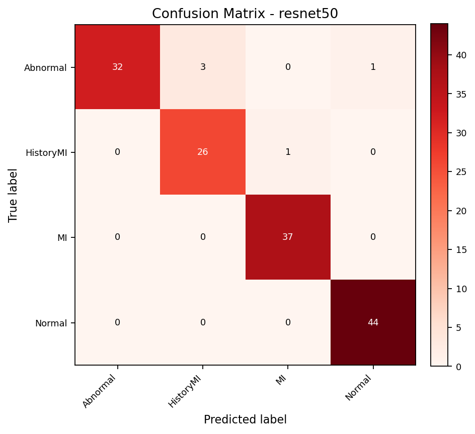
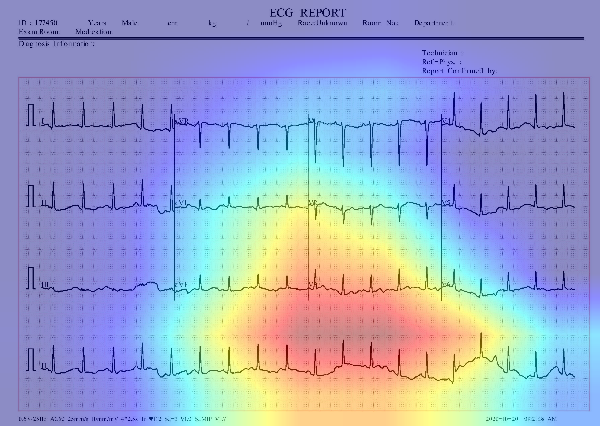
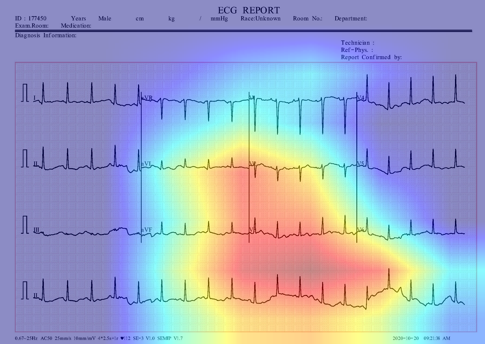
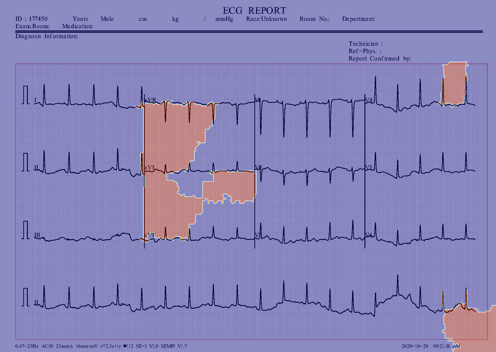
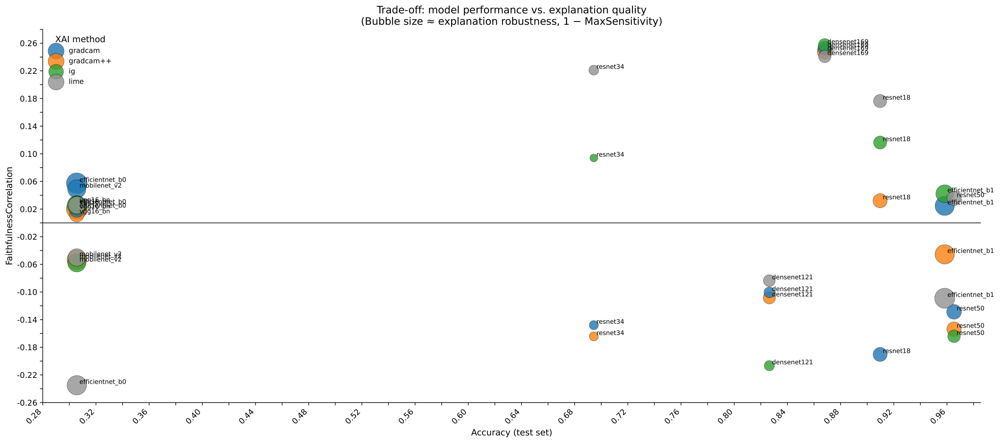
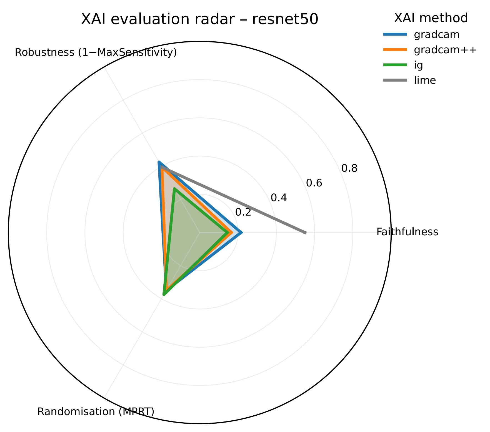
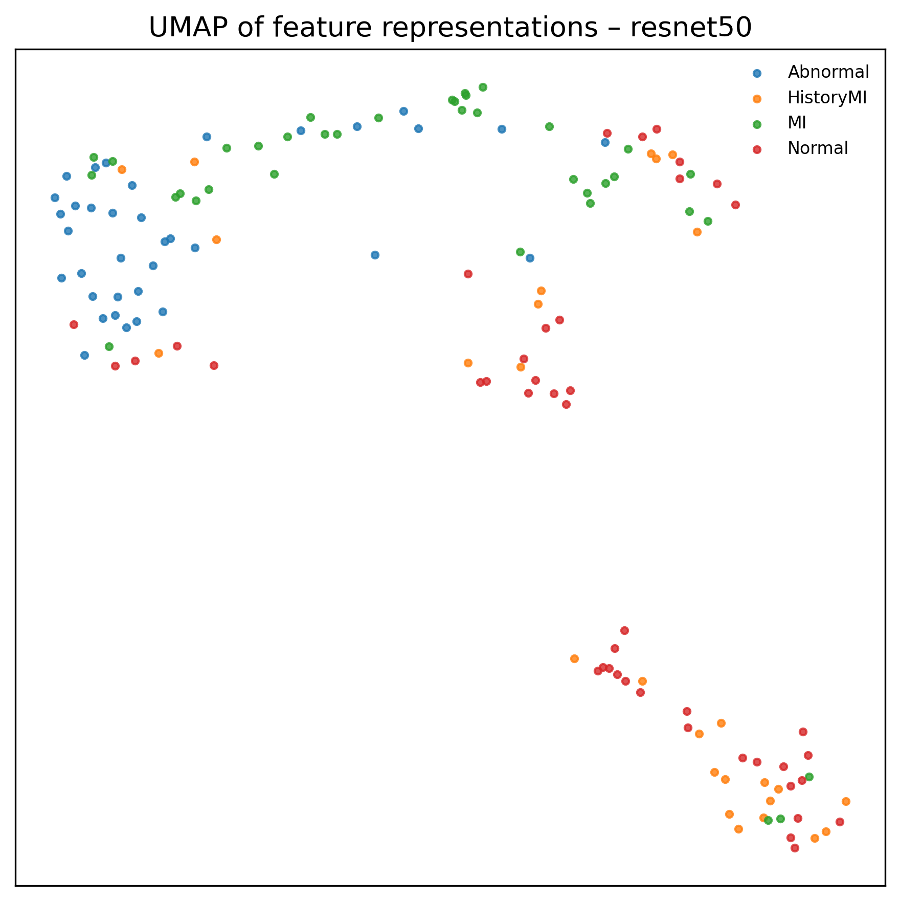

<p align="center">
  
</p>

<h1 align="center"><b>ECG-XAI Quantus Evaluation</b></h1>
<h3 align="center"><b>A toolkit to train ECG models and evaluate XAI explanations with Quantus</b></h3>

<p align="center">
  PyTorch • Quantus • OmniXAI • ECG Classification
  <br><br>

  <!-- Badges -->
  <a href="https://www.python.org/">
    
  </a>
  <a href="https://pytorch.org/">
    
  </a>
  <a href="https://github.com/understandable-machine-intelligence-lab/Quantus">
    
  </a>
  <a href="https://github.com/salesforce/OmniXAI">
    
  </a>
  <a href="https://data.mendeley.com/datasets/gwbz3fsgp8/2">
    
  </a>
  <a href="#">
    
  </a>
</p>

<p align="center">
  <i>This repository is under active development. Please note the exact environment and library versions for reproducible results.</i>
</p>


---

## Table of Contents

- [Introduction](#introduction)  
- [Features](#features)  
- [Installation](#installation)  
- [Quick Start](#quick-start)  
- [Workflow](#workflow)  
- [Project Structure](#project-structure)  
- [Models & XAI Methods](#models--xai-methods)  
- [Outputs](#outputs)  
- [Configuration](#configuration)  
- [Troubleshooting](#troubleshooting)  
- [References](References)

---

## Introduction

This repository provides an **end-to-end framework** for:

- Training deep learning models for ECG classification  
- Generating explanations with multiple XAI methods  
- Evaluating the quality of explanations with **Quantus** metrics  
- Producing visualizations and plots for analysis and reporting  

It is designed to be:

- **Reproducible** – configuration and environment files are provided  
- **Extensible** – new models and XAI methods can be added  
- **Practical** – ready to be used in research and student projects  

---

## Features

- 🧠 Deep learning models for ECG classification (e.g. ResNet, EfficientNet, DenseNet, VGG, MobileNet)  
- 🔍 Multiple XAI methods: GradCAM, GradCAM++, Integrated Gradients, LIME, OmniXAI-based methods  
- 📊 Quantitative explainability benchmarking via **Quantus**  
- 📈 Automated scripts:
  - Model evaluation
  - XAI generation
  - Quantus metric computation
  - Plot and visualization creation  
- 🧪 Reproducible experiments using configuration files  
- 🗂️ Structured outputs (`checkpoints/`, `explanations/`, `metrics/`, `plots/`, …)  

---

## Installation

> ⚠️ **Note:** Recommended: Use Anaconda or Miniconda to manage environments.
This ensures reproducible dependencies and prevents conflicts with PyTorch, CUDA, Quantus, and OmniXAI.

You can either install a **CPU-only environment** (recommended for laptops) or use a **GPU environment** on machines with a compatible NVIDIA GPU and CUDA.

### 💻 Option A — CPU-only (not-recommended)

```bash
conda env create -f env.cpu.yml
conda activate ecg-xai-cpu
```
This setup does not require CUDA and should work on most systems.

---

### ⚡ Option B — GPU Environment (requires NVIDIA GPU + CUDA)

    conda env create -f env.yml
    conda activate ecg-xai-gpu

> ⚠️ **Note:** The GPU environment may fail on systems without compatible drivers or CUDA libraries.  
> If PyTorch cannot initialize CUDA, please use the CPU environment instead.

---

## Quick Start

After the environment is set up and the dataset is prepared (see your local data instructions), you can run the full pipeline step by step.

## Workflow

### 1️⃣ Train all models  
This step trains the configured models and stores the best checkpoints under:

outputs/checkpoints/

```bash
python -m src.train
```
---

### 2️⃣ Evaluate trained models  
Computes classification metrics (accuracy, confusion matrix, etc.) for all models.
```bash
python run_all_eval.py
```

All evaluation results are automatically saved under:

outputs/metrics/**<model_name>**/

📁 Example (ResNet50)
outputs/metrics/resnet50/
- classification_report.txt
- confusion_matrix.png
- confusion_matrix.csv
- history.csv
- predictions.csv

📊 Example Outputs
Confusion Matrix

A visual overview of class-wise prediction performance:

<p align="center">
  
</p>

---
### 3️⃣ Generate XAI heatmaps & Integrated Gradients  
Creates explainability outputs (GradCAM, GradCAM++, IG, etc.) for each model.
```bash
python run_all_xai.py
```
Explanations are stored per model and method:
outputs/explanations/**<model_name>**/**<xai_method>**/

### 🔍 Example XAI Outputs (per Image)

Below is an example of the generated explanations for one ECG sample  
produced by different XAI methods:

<p align="center">
  
  
  
  
</p>

<p align="center">
  <b>GradCAM</b> &nbsp; | &nbsp;
  <b>GradCAM++</b> &nbsp; | &nbsp;
  <b>Integrated Gradients</b> &nbsp; | &nbsp;
  <b>LIME</b>
</p>


---
### 4️⃣ Compute Quantus metrics  
Runs configured Quantus metrics (e.g., faithfulness, robustness).
```bash
python run_all_quantus.py
```
stored in: 

outputs/metrics/quantus_<model_name>**_**<xai_method>.csv

## 📊 Quantus Metric Results (ResNet50 — Example)

| Method               | Faithfulness Corr | Max Sensitivity | MPRT       |
|----------------------|-------------------|------------------|------------|
| GradCAM             | -0.1287           | 0.9443           | -0.02515   |
| GradCAM++           | -0.1537           | 0.9471           | -0.02519   |
| Integrated Gradients | -0.1641          | 0.9586           | -0.02193   |
| LIME                | 0.03546           | 0.9471           | n/a        |


---
### 5️⃣ Generate plots  
Creates performance graphs, radar charts, sensitivity plots, and more.
```bash
python run_all_plots.py
```

Example outputs:

<p align="center">   </p>

---
### 6️⃣ Create visualization dashboards & composite figures
```bash
python run_all_visualizations.py
```
Example outputs:

<p align="center">  


## Project Structure

### Data

- `data/ecg_train/` – Trainingsdaten, nach Klassenordnern (Abnormal, HistoryMI, MI, Normal)
- `data/ecg_val/` – Validierungsdaten
- `data/ecg_test/` – Testdaten
- `data/ecg_images/` – ggf. Originalbilder oder zusätzliche Rohdaten

> ⚠️ **Note:** This repository contains a processed ECG image dataset that is already split into train/validation/test subsets. The original dataset creators must be cited as follows:

```bash
Khan, Ali Haider; Hussain, Muzammil  (2021), “ECG Images dataset of Cardiac Patients ”, Mendeley Data, V2, doi: 10.17632/gwbz3fsgp8.2
```

---

### **Outputs**
- **outputs/checkpoints/** — Trained model weights (`.pt`)
- **outputs/explanations/** — XAI heatmaps and Integrated Gradients outputs
- **outputs/metrics/** — Quantus metrics, confusion matrices, prediction files
- **outputs/plots/** — Generated figures and visualizations
- **outputs/results/** — Aggregated tables and summaries

---

### **Source Code**
- **src/train.py** — Training pipeline  
- **src/eval.py** — Evaluation logic  
- **src/quantus_eval.py** — Quantus metric computation  
- **src/explain_omnixai.py** — OmniXAI integration  
- **src/model_def.py** — Model definitions (ResNet, EfficientNet, etc.)  
- **src/utils.py** — Helper functions  
- **src/configs.py** — Configuration handling  

---

### **Pipeline Scripts**
- **run_all_eval.py** — Evaluate all trained models  
- **run_all_xai.py** — Generate all XAI explanations  
- **run_all_quantus.py** — Compute all Quantus metrics  
- **run_all_plots.py** — Produce performance and XAI plots  
- **run_all_visualizations.py** — Create visualization dashboards  

---

### **Environment Files**
- **env.cpu.yml** — CPU-only environment  
- **env.yml** — GPU environment (CUDA required)

---

### **Documentation**
- **README.md** — Main project documentation


## Models & XAI Methods

### **Supported Models (examples)**
- **ResNet** (ResNet18, ResNet34, ResNet50)
- **EfficientNet** (B0, B1)
- **DenseNet** (DenseNet121,DenseNet169)
- **VGG** (VGG16)
- **MobileNetV2**

Model architectures are defined here:
src/model_def.py

## Supported Explainability Methods

### **Gradient-based**
- GradCAM  
- GradCAM++  
- Integrated Gradients  

### **Model-agnostic**
- LIME  

### **Framework-based**
- OmniXAI explainers  
  → https://github.com/salesforce/OmniXAI

### **Quantitative Metrics**
- Faithfulness  
- Robustness  
- Complexity  
- Randomization checks  
- Additional Quantus metrics  
  → https://github.com/understandable-machine-intelligence-lab/Quantus


---

## Outputs

### **Model Checkpoints**  
Examples:
outputs/checkpoints/resnet50_best.pt  
outputs/checkpoints/efficientnet_b1_best.pt

### **Explanations**  
Examples:
outputs/explanations/resnet50/gradcam/  
outputs/explanations/efficientnet_b1/ig/

### **Metrics**  
Examples:
outputs/metrics/resnet50/confusion_matrix.png  
outputs/metrics/resnet50/predictions.csv  
outputs/metrics/resnet50/quantus_results.json

### **Visualizations**  
Examples:
outputs/plots/performance_vs_xai.png  
outputs/plots/quantus_radar.png  
outputs/plots/heatmap_grid.png

---

## Configuration

Most experiment settings such as:
- model names  
- batch size  
- learning rate  
- dataset paths  
- number of epochs  

are controlled inside:
src/configs.py

You can extend or modify models and parameters there to run new experiments.


## Troubleshooting

### **PyTorch reports missing CUDA libraries**
If you see an error like:
```bash
CUDA driver not found  
torch.cuda.is_available() == False
```

Use the CPU environment:
```bash 
conda activate ecg-xai-cpu
```

---

### **OmniXAI fails to import**
Ensure the version matches your environment:
```bash 
pip install omnixai==1.3.1
```

---

### **Quantus metric crashes or returns NaN**
Some metrics require specific shapes or valid ranges. Try:
- Reducing the number of metrics  
- Ensuring explanations and predictions are aligned  
- Adjusting settings inside:
src/quantus_eval.py

---
Enjoy exploring **explainable AI for ECG data!** ⚡

---

## References

1. Acharya, U.R., Fujita, H., Oh, S.L., Hagiwara, Y., Tan, J.H., Adam, M.: Applica-
tion of deep convolutional neural network for automated detection of myocardial
infarction using ecg signals. Information sciences 415, 190–198 (2017)
2. Adebayo, J., Gilmer, J., Muelly, M., Goodfellow, I., Hardt, M., Kim, B.: Sanity
checks for saliency maps. Advances in neural information processing systems 31
(2018)
3. Aversano, L., Bernardi, M.L., Cimitile, M., Montano, D., Pecori, R.: Early diagnosis
of cardiac diseases using ecg images and cnn-2d. Procedia Computer Science 225,
2866–2875 (2023)
4. Cabitza, F., Campagner, A., Natali, C., Parimbelli, E., Ronzio, L., Cameli, M.:
Painting the black box white: experimental findings from applying xai to an ecg
reading setting. Machine Learning and Knowledge Extraction 5(1), 269–286 (2023)
5. Chattopadhay, A., Sarkar, A., Howlader, P., Balasubramanian, V.N.: Grad-
cam++: Generalized gradient-based visual explanations for deep convolutional
networks. In: 2018 IEEE winter conference on applications of computer vision
(WACV). pp. 839–847. IEEE (2018)
6. Goettling, M., Hammer, A., Malberg, H., Schmidt, M.: xecgarch: a trustworthy
deep learning architecture for interpretable ecg analysis considering short-term
and long-term features. Scientific Reports 14(1), 13122 (2024)
7. Harris, C.R., Millman, K.J., Van Der Walt, S.J., Gommers, R., Virtanen, P., Cour-
napeau, D., Wieser, E., Taylor, J., Berg, S., Smith, N.J., et al.: Array programming
with numpy. nature 585(7825), 357–362 (2020)
8. He, K., Zhang, X., Ren, S., Sun, J.: Deep residual learning for image recognition. In:
Proceedings of the IEEE conference on computer vision and pattern recognition.
pp. 770–778 (2016)
9. Hedström, A., Weber, L., Krakowczyk, D., Bareeva, D., Motzkus, F., Samek, W.,
Lapuschkin, S., Höhne, M.M.C.: Quantus: An explainable ai toolkit for respon-
sible evaluation of neural network explanations and beyond. Journal of Machine
Learning Research 24(34), 1–11 (2023)
10. Huang, G., Liu, Z., Van Der Maaten, L., Weinberger, K.Q.: Densely connected
convolutional networks. In: Proceedings of the IEEE conference on computer vision
and pattern recognition. pp. 4700–4708 (2017)
11. Khan, A.H., Hussain, M., et al.: Ecg images dataset of cardiac patients. Mendeley
Data 2 (2021)
12. Kindermans, P.J., Hooker, S., Adebayo, J., Alber, M., Schütt, K.T., Dähne, S.,
Erhan, D., Kim, B.: The (un) reliability of saliency methods. In: Explainable AI:
Interpreting, explaining and visualizing deep learning, pp. 267–280. Springer (2019)
13. Loshchilov, I., Hutter, F.: Decoupled weight decay regularization. arXiv preprint
arXiv:1711.05101 (2017)
14. Paszke, A., Gross, S., Massa, F., Lerer, A., Bradbury, J., Chanan, G., Killeen,
T., Lin, Z., Gimelshein, N., Antiga, L., et al.: Pytorch: An imperative style, high-
performance deep learning library. Advances in neural information processing sys-
tems 32 (2019)
15. Rajpurkar, P., Hannun, A.Y., Haghpanahi, M., Bourn, C., Ng, A.Y.: Cardiologist-
level arrhythmia detection with convolutional neural networks. arXiv preprint
arXiv:1707.01836 (2017)
16. Ribeiro, M.T., Singh, S., Guestrin, C.: " why should i trust you?" explaining the
predictions of any classifier. In: Proceedings of the 22nd ACM SIGKDD interna-
tional conference on knowledge discovery and data mining. pp. 1135–1144 (2016)
17. Riek, N.T., Gokhale, T.A., Martin-Gill, C., Kraevsky-Philips, K., Zègre-Hemsey,
J.K., Saba, S., Callaway, C.W., Akcakaya, M., Al-Zaiti, S.S.: Clinical usability of
deep learning-based saliency maps for occlusion myocardial infarction identification
from the prehospital 12-lead electrocardiogram. Journal of electrocardiology 87,
153792 (2024)
18. van Rossum, G.: Python tutorial. Tech. Rep. CS-R9526, Centrum voor Wiskunde
en Informatica (CWI), Amsterdam (May 1995)
19. Salih, A.M., Galazzo, I.B., Gkontra, P., Rauseo, E., Lee, A.M., Lekadir, K., Radeva,
P., Petersen, S.E., Menegaz, G.: A review of evaluation approaches for explainable
ai with applications in cardiology. Artificial Intelligence Review 57(9), 240 (2024)
20. Sandler, M., Howard, A., Zhu, M., Zhmoginov, A.: Chen l. MobileNetV2: Inverted
residuals and linear bottlenecks (2019)
21. Selvaraju, R.R., Cogswell, M., Das, A., Vedantam, R., Parikh, D., Batra, D.: Grad-
cam: Visual explanations from deep networks via gradient-based localization. In:
Proceedings of the IEEE international conference on computer vision. pp. 618–626
(2017)
22. Simonyan, K., Zisserman, A.: Very deep convolutional networks for large-scale
image recognition. arXiv preprint arXiv:1409.1556 (2014)
23. Storås, A.M., et al.: Usefulness of heat map explanations for deep-learning-based
electrocardiogram analysis. Diagnostics 13(14) (2023)
24. Sundararajan, M., Taly, A., Yan, Q.: Axiomatic attribution for deep networks. In:
International conference on machine learning. pp. 3319–3328. PMLR (2017)
25. Tan, M., Le, Q.: Efficientnet: Rethinking model scaling for convolutional neural
networks. In: International conference on machine learning. pp. 6105–6114. PMLR
(2019)
26. Wagner, P., Mehari, T., Haverkamp, W., Strodthoff, N.: Explaining deep learning
for ecg analysis: Building blocks for auditing and knowledge discovery. Computers
in biology and medicine 176, 108525 (2024)
27. Yang, W., Le, H., Laud, T., Savarese, S., Hoi, S.C.: Omnixai: A library for explain-
able ai. arXiv preprint arXiv:2206.01612 (2022)